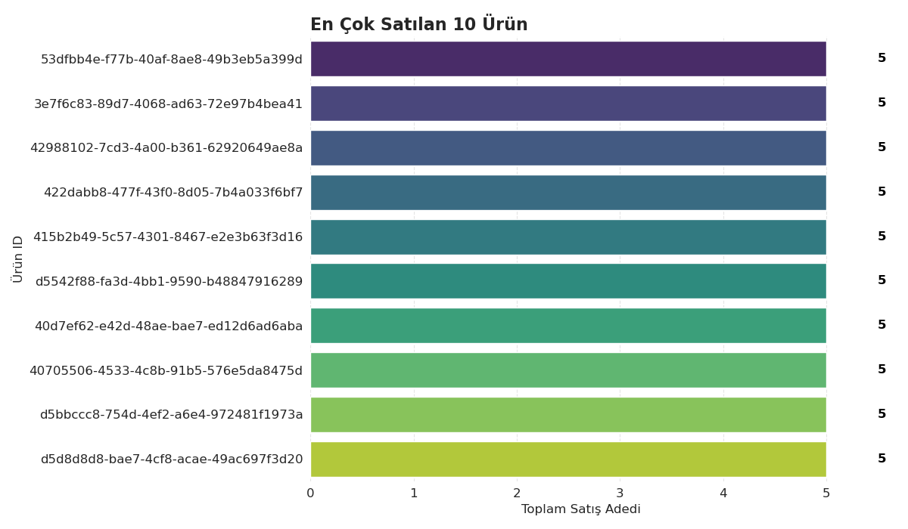
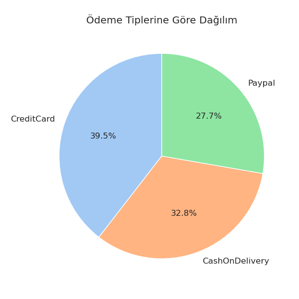
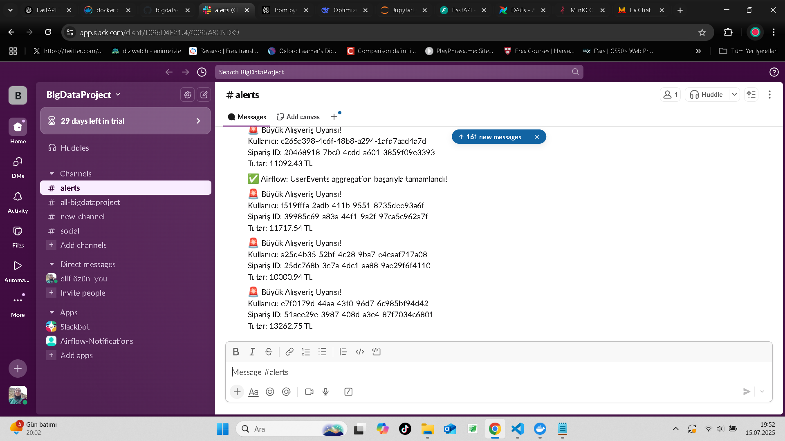

# Big Data Project

Bu proje, modern büyük veri teknolojileriyle gerçek zamanlı veri üretimi, akışı, işlenmesi, analizi ve sonuçların kalıcı veri tabanlarına kaydedilmesini kapsamaktadır. Tüm bileşenler Docker üzerinde entegre çalışır ve aşağıdaki iş akışını gerçekleştirir:

---

## Proje Akışı ve Bileşenler

1. **FastAPI Web API**
    - Kullanıcı etkinlikleri ve satın alma işlemleri için iki endpoint:
        - `PUT /SendEvent`: Tekil kullanıcı etkinliği (UserId, SessionId, EventName, TimeStamp, Attributes, ProductId, Price, Discount)
        - `POST /PurchasedItems`: Birden fazla satın alma kaydı (SessionId, TimeStamp, UserId, TotalPrice, OrderId, Products[ProductId, ItemCount, ItemPrice, ItemDiscount], PaymentType)
    - Gelen verileri Kafka’da iki ayrı topic’e iletir: `UserEvents` ve `PurchasedItem`.

2. **Data Generator**
    - Faker kütüphanesi ile rastgele UserEvent ve PurchasedItem verisi üretir.
    - Her saniye FastAPI’ye yeni kayıtlar gönderir.

3. **Apache Kafka**
    - Gerçek zamanlı veri akışı için iki topic: `UserEvents` ve `PurchasedItem`.

4. **Airflow DAG**
    - Her 2 dakikada bir Kafka’dan UserEvents verilerini toplar ve MongoDB’ye kaydeder.
    - Ardından MongoDB’de kullanıcı başına event türü sayısını aggregate edip başka bir collection’a yazar.

5. **MongoDB**
    - UserEvents ve event count aggregation sonuçlarını saklar.

6. **PySpark Streaming**
    - Kafka’daki `PurchasedItem` topic’ine subscribe olur.
    - Gelen satın alma verilerini MinIO S3 bucket’ına Parquet formatında yazar.

7. **MinIO (S3 Uyumlu Depolama)**
    - PySpark ile yazılan satın alma verilerini saklar.

8. **Jupyter Notebook ile Analiz**
    - MinIO’daki Parquet dosyalarını Spark ile okur.
    - Analizler:
        - En çok satılan ürünler
        - En çok tercih edilen ödeme tipi
        - Son 1 saatte en yüksek tutarlı siparişi veren top 10 müşteri
        - Aynı ürünü birden çok kez satın alan müşteriler ve ürünler (**bu analiz Postgres’e yazılır**)
    - Analiz sonuçlarını PostgreSQL’e kaydeder.

9. **PostgreSQL**
    - Analiz sonuçlarının kalıcı olarak saklandığı ilişkisel veritabanı.
    - Ek bir notebook ile, Postgres’teki verilerden:
        - En çok tekrar tekrar satın alınan en popüler ilk 10 ürün SQL ile bulunur.

---

## Kullanılan Teknolojiler

- FastAPI
- Faker (Data Generator)
- Apache Kafka
- Apache Airflow
- MongoDB
- Apache Spark (PySpark)
- MinIO
- PostgreSQL
- Jupyter Notebook
- Docker & Docker Compose

---

## Kurulum ve Çalıştırma

1. **Tüm servisleri başlatın:**
    ```
    docker-compose up -d
    ```
2. **Data Generator’ı başlatın:**  
   (API’ye sürekli veri göndermeye başlar)
3. **Airflow, Spark ve diğer servislerin loglarını kontrol edin.**
4. **Jupyter Notebook’u açıp analiz adımlarını çalıştırın.**
5. **PostgreSQL’de analiz sonuçlarını ve SQL sorgularını inceleyin.**

---

## Dizin Yapısı

- `docker-compose.yaml` : Tüm servislerin Docker konfigürasyonu
- `fastapi-app/` : FastAPI uygulaması kodları
- `data-generator/` : Faker ile veri üreten Python scripti
- `airflow/` : Airflow DAG’ları ve konfigürasyonları
- `spark-app/` : PySpark ile Kafka’dan MinIO’ya veri yazan kod
- `notebooks/` : Analiz ve SQL notebookları

---

## Analizler ve Sonuçlar

- **En çok satılan ürünler**
- **En çok tercih edilen ödeme tipi**
- **Son 1 saatte en yüksek tutarlı siparişi veren top 10 müşteri**
- **Aynı ürünü birden çok kez satın alan müşteriler ve ürünler** (Postgres’e yazılır)
- **En çok tekrar tekrar satın alınan ilk 10 ürün** (SQL ile Postgres’ten çekilir)

---


# Ekstra Geliştirmeler (Ödev Kapsamı Dışında)

Proje gereksinimlerinin ötesinde yapılan ek analiz ve görselleştirme çalışmaları:

- PySpark ile MinIO’daki Parquet dosyalarının okunması  
- Ürün verilerinin `explode` edilerek pandas DataFrame’e dönüştürülmesi  
- En çok satılan 10 ürünün bar grafiği ile görselleştirilmesi  
- Ödeme tiplerinin pasta grafiği ile sunulması  
- Grafiklerde estetik ve okunabilirlik odaklı iyileştirmeler yapıldı ve kaydedildi.

### En Çok Satılan Ürünler


### Ödeme Türleri


---

## 🛰️ Airflow ve PySpark Slack Bildirim Otomasyonu

Bu projede uçtan uca veri akışı ve otomasyonunu takip edebilmeniz için, **Slack bildirimleri** hem **Airflow** hem de **PySpark** tarafından otomatik olarak gönderilmektedir.


### 📡 1. Airflow DAG’ı ile Bildirim

- **Kafka**’dan `UserEvents` verileri toplanır.
- Veriler **MongoDB**’ye kaydedilir ve **aggregation** işlemleri gerçekleştirilir.
- Tüm işlemler başarıyla tamamlandığında, **Slack kanalına otomatik bildirim** gider.

#### 🎯 Örnek Bildirim Mesajı:
```text
✅ Airflow: UserEvents aggregation başarıyla tamamlandı!
```


### ⚡ 2. PySpark ile Büyük Tutar Alışveriş Bildirimi

- **PySpark**, Kafka’daki `PurchasedItem` topic’inden alışveriş verilerini **sürekli izler**.
- Toplam tutarı **10.000 TL**’den büyük olan alışverişleri algılar ve Slack’in `#alerts` kanalına otomatik olarak bildirir.
- Küçük işlemler için bildirim gönderilmez; yalnızca dikkat çekici işlemler öne çıkar.

#### 🎯 Örnek PySpark Bildirim Mesajı:
```text
🚨 Büyük Alışveriş Uyarısı!
Kullanıcı: 2fef2298-d574-4cfd-b106-07a3d1a3da35
Sipariş ID: caffa447-bee2-49c2-a573-088d68ad6f17
Tutar: 10618.65 TL
```


## 💬 Slack’te Gelen Otomatik Bildirimler

Aşağıda, sistemin çalışır durumda olduğu ve yüksek tutarlı alışverişlerde Slack’e başarılı şekilde bildirim gönderdiği bir kanal ekran görüntüsü bulunmaktadır:




Bu geliştirme ile, gerçek zamanlı veri akışı ve önemli durumlar için ekibe haber verme yeteneğiyle **modern, profesyonel bir otomasyon örneği** sunar. Hem analiz hem de monitoring için kolayca genişletilebilir yapıdadır.

---

## 🛡 Veri Kalitesi ve Hatalı Veri Yönetimi

Veri akışında düşük kaliteli, eksik ya da hatalı verilerin üretim hattını bozmadan izlenmesi sağlanmıştır.  
**PySpark Streaming** tarafında, satın alma verileri alınırken gelen kayıtlar anlık olarak kontrol edilir:

- **Geçerli (Valid) kayıtlar:**  
  Zorunlu alanları (SessionId, UserId, OrderId, TotalPrice) eksiksiz ve TotalPrice > 0 olanlar,  
  otomatik olarak MinIO’daki `purchased-items/valid/` klasörüne Parquet formatında yazılır.

- **Hatalı (Invalid) kayıtlar:**  
  Eksik, boş, null veya TotalPrice ≤ 0 olan kayıtlar,  
  veri kaybı olmaması amacıyla `purchased-items/invalid/` klasörüne yazılır.

Bu sayede:
- İş akışı sadece kaliteli verilerle devam eder.
- Hatalı kayıtlar izlenebilir ve gerektiğinde analiz için kullanılabilir.


---

## Katkı ve İletişim

Her türlü soru ve öneriniz için [GitHub Issues](https://github.com/1sancaktar15/bigdata-project/issues) üzerinden iletişime geçebilirsiniz.

---

> Proje dokümantasyonu ve iş akışı, [ProjeOdeviBigData.pdf][1] dokümanındaki gereksinimleri tam olarak karşılayacak şekilde hazırlanmıştır.

[1]: https://github.com/1sancaktar15/bigdata-project/blob/main/ProjeOdeviBigData.pdf
